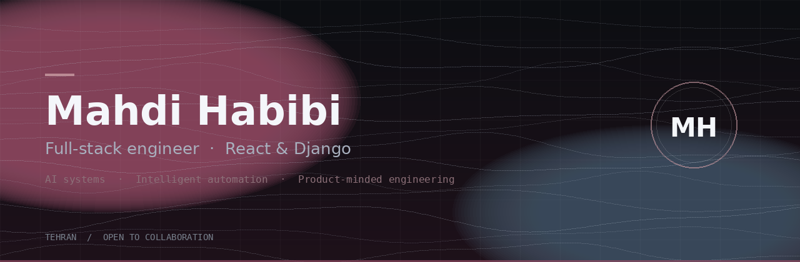

<!--
  Profile README — Mahdi Habibi
  Clean, intentional, and easy to maintain.
-->

  

<h1 align="center">Mahdi Habibi</h1>

  <strong>Full-stack engineer</strong> building thoughtful web products with <strong>React</strong> &amp; <strong>Django</strong>. 
  Exploring AI systems, intelligent automation, and clean architecture.

  
  
  
  

---

### About

I design and ship full-stack applications end to end — from API design and data models to interfaces people actually enjoy using. Currently focused on AI-assisted products and automation, while deepening computer architecture as a Master's student at **Shahid Beheshti University**.

**What I care about**
- Clear systems over clever ones
- Interfaces that feel calm and intentional
- Shipping work that holds up in production

**Open to**
- Collaboration on AI-driven apps, automation tools, and serious full-stack builds
- Mentorship, pairing, and product-minded engineering conversations

---

### Stack

<strong>Languages & frameworks</strong>

 

<strong>Data, tooling & design</strong>

 

---

### Selected work

| Project | Focus | Links |
| :--- | :--- | :--- |
| **Pathwise** | Adaptive learning platform — Next.js, NestJS, Prisma | [Repo](https://github.com/Mahdi-Habibi/pathwise) · [Live](https://mahdi-habibi.github.io/pathwise/) |
| **Pocket Crypto** | Telegram bot for live currency & crypto markets | [Repo](https://github.com/Mahdi-Habibi/pocket_crypto) · [Live](https://pocketcrypto.vercel.app) |
| **Task Platform** | Real-time task management with JWT & Socket.IO | [Repo](https://github.com/Mahdi-Habibi/task-management-platform) |
| **Smart Home IoT** | MQTT dashboard for sensors & device control | [Repo](https://github.com/Mahdi-Habibi/smart-home-iot-dashboard) |
| **Portfolio** | Personal site — React & Django specialist | [Repo](https://github.com/Mahdi-Habibi/portfolio) · [Live](https://mahdi-habibi.github.io/portfolio/) |

---

### GitHub

  
  

  

  

---

  
    Building in public · Based in Tehran ·
    <a href="mailto:info.mahdihabibi@gmail.com">Say hello</a>
  

